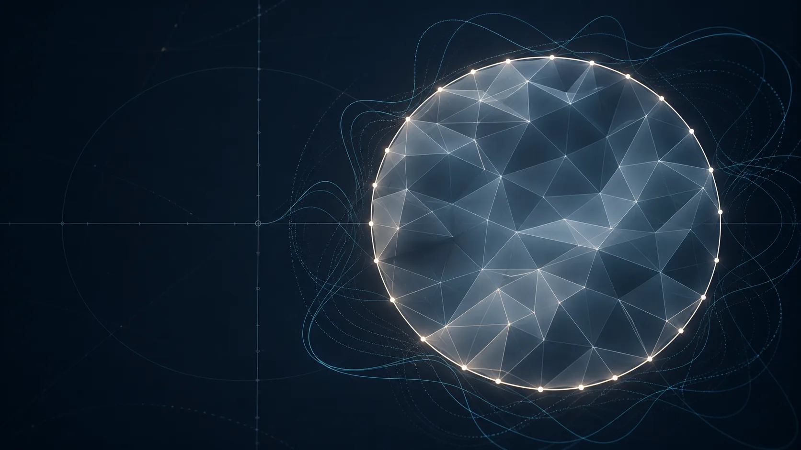

# Fourier bounds for filling area

This project is a Lean 4 formalization of the Fourier, topology, planar area,
and certificate arguments accompanying Yimin Zhong's research note on
Gromov's filling-area problem.

!!! warning "Current verification boundary"
    The repository does not prove Gromov's conjecture. The manuscript proves
    lower bounds below the conjectural value `2π`, and the Lean headline
    theorems remain conditional on specific Riemannian-surface foundations.

  
<strong>4,134</strong>project declarations accepted by the live axiom audit

  
<strong>Lean 4.29</strong>pinned toolchain with mathlib 4.29 and a fixed Jordan input

  
<strong>MIT</strong>public source, reproducible CI, and explicit claim boundaries

## What is verified

The kernel-checked development includes exact Fourier coefficients, the Givens
mixing matrix, dominant-harmonic Jordan curves, integer circle degree, finite
mod-2 surface obstruction, planar area and Jacobian inequalities, rigorous
constant evaluation, off-diagonal logarithmic-sine-kernel positivity, de
Sitter profile identities, finite one-high-leg Gram/Rayleigh algebra, exact
scalar resonance-trace arithmetic, and conditional certificate assembly.

The general glued-polygon theorem now handles every fixed-point-free
involutive side pairing, including orientation-reversing identifications. The
lower boundary obstruction is derived automatically rather than supplied as a
caller assumption.

## Explore the project

-   **Mathematics**

    Follow the argument from boundary distance profiles to Fourier maps,
    Jordan coverage, Jacobian budgets, and explicit constants.

    [Read the mathematical map](mathematics.md)

-   **Formalization boundary**

    See exactly which manuscript statements are verified, partial, or still
    open, with no headline overclaim.

    [Inspect the claim boundary](formalization.md)

-   **Lean modules**

    Navigate the source by proof layer and find the canonical umbrella import.

    [Browse the module map](modules.md)

-   **Verification**

    Reproduce the build and understand the source scan, import check, and live
    axiom audit.

    [Run the verification](verification.md)

## Current frontier

Four end-to-end bridges remain outside the verified scope:

1. extraction of the unique simplicial boundary cycle, up to a circle
   homeomorphism, from the verified boundary-facewise-regular Radó output;
2. Riemannian eikonal and parameter-integral differentiation;
3. globalization of the planar area formula through surface charts;
4. a global differential-form Stokes/comass interface for the oriented case.

The repository keeps these foundations visible. It does not replace them with
project axioms or encode an open target as a hypothesis and call the result a
proof.
