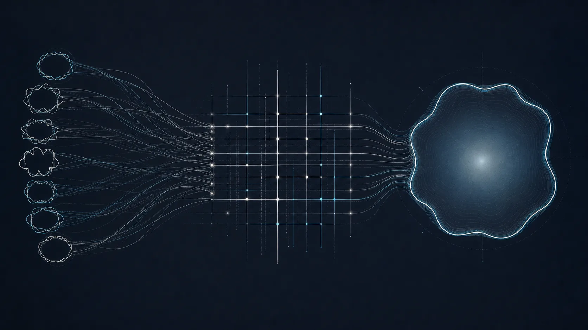

# Mathematical architecture

The formal development turns metric boundary data into explicit planar
certificates. Its strongest unconditional statements are finite, algebraic,
topological, and planar. The final passage to arbitrary Riemannian surfaces is
tracked separately.

<div class="research-hero" markdown>

</div>

<div class="proof-flow">
  <div><strong>Distance profiles</strong><span>Boundary distances produce odd Fourier coordinates with exact boundary values.</span></div>
  <div><strong>Orthogonal mixing</strong><span>Explicit Givens rotations preserve energy and force first-harmonic dominance.</span></div>
  <div><strong>Jordan coverage</strong><span>Degree and mod-2 obstruction force the bounded Jordan region into the image.</span></div>
  <div><strong>Area certificate</strong><span>Planar Jacobian budgets and exact boundary area yield finite and asymptotic bounds.</span></div>
</div>

## Boundary distance profiles

For a boundary parametrization `γ`, the metric profile records the distance
from an interior point to every boundary point. Its odd Fourier modes have
exact boundary values

```text
z_n(γ(s)) = -4 / (π n²) exp(i n s),   n positive and odd.
```

The Lean development proves the triangle-wave coefficients, continuity,
global Lipschitz bounds, planar weak differentiation, and finite Bessel energy
estimates for these genuine metric-defined maps.

## Givens untwisting

Higher odd modes wind several times around the origin. The project defines an
explicit orthogonal Givens product that mixes finitely many Fourier modes while
preserving their derivative energy. Every mixed row satisfies strict
first-harmonic dominance, so its boundary curve is injective and has degree
`+1`.

## Jordan regions and mod-2 topology

The formalization transports the Jordan curve theorem to the complex plane,
identifies the bounded degree-one component containing the origin, and proves
coverage from an odd boundary-degree obstruction.

The finite polygonal obstruction is fully assembled: face cuts, real lifts,
integer edge turns, and the signed boundary-turn identity are constructed in
Lean. The general glued-pairing theorem covers both preserving and reversing
side identifications.

## Finite one-high-leg ceiling

For `J` normalized resonances, Lean exhibits the positive odd test frequency
`m = 2J+1`, proves its unit norm and anti-periodicity, and computes the exact
occupied-coordinate symplectic cost

```text
1 + ∑ j, μ_j².
```

The displayed finite resonance matrix is constructed entry by entry from its
convergent odd-mode series. Its quadratic form is proved equal to the boundary
action series and is decomposed into a sum of nonnegative weighted squares.
This gives positive semidefiniteness, shows that the largest Rayleigh value is
an eigenvalue, and proves the finite ceiling whenever the ambient comass
bounds the exhibited high-mode plane.

The remaining interface is analytic rather than finite-dimensional: the
modeled occupied outputs must still be identified with the derivative of the
full normalized nonlinear map on its infinite coefficient space and then with
the global ambient comass.

## Resonance trace arithmetic

The scalar series underlying the exact-trace calculation is now verified:

$$
\sum_{j,k\ge 0}\frac{16}{\pi}\frac{2k+1}{(2k+1+2j)^4}
=\frac{\pi}{2}+\frac{7\zeta(3)}{\pi}+\frac{\pi^3}{24}.
$$

Lean proves summability and the nonnegative Tonelli/antidiagonal regrouping,
not merely the final arithmetic identity. The separate construction of the
infinite matrix as a positive trace-class operator on ℓ², and the proof that
its operator trace equals this scalar series, remain open.

## Planar area and explicit constants

For Lipschitz maps on planar pieces, the project proves a genuine area
inequality from Rademacher's theorem and mathlib's Jacobian image bound. It
then composes coverage, exact Fourier area, and the common derivative-energy
budget. The pointwise two-dimensional Riemannian Jacobian is now defined
intrinsically between arbitrary Riemannian surfaces, proved independent of
orthonormal bases and multiplicative under the manifold chain rule, and
identified exactly with this planar absolute-determinant density. The
chart-induced area measure, its exact weighted `lintegral` transfer, the local
surface area inequality, and its summation over a countable covering chart
family are verified. The remaining step is to prove standard smooth and
boundary charts satisfy those interfaces, establish invariance on overlaps
(or a compatible disjointification), and identify the construction with the
canonical global area measure.

The orientation-free constant is

```text
14 ζ(3) / π = 5.3567723444...
```

The oriented nonlinear certificate at `λ = 0.03` gives the rigorous scalar
conclusion

```text
area > 5.38982446
```

Both headline surface statements remain conditional until the intrinsic
Riemannian globalization described on the
[formalization page](formalization.md) is supplied.
